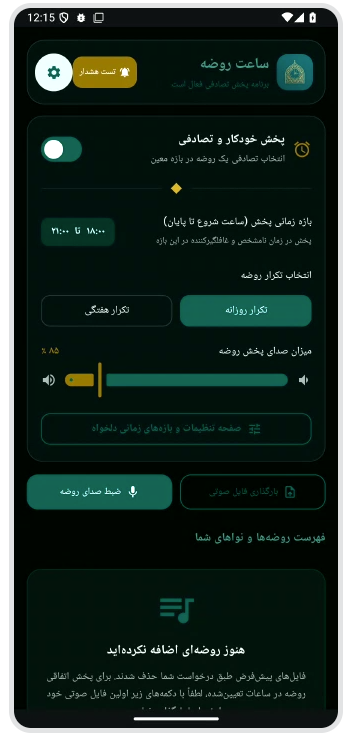
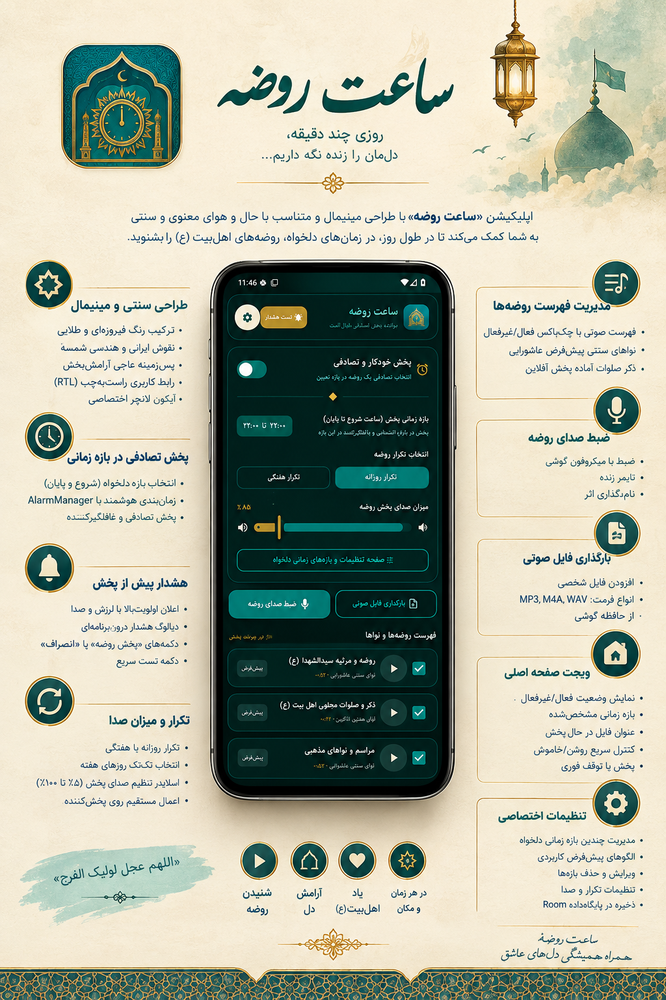

<div dir="rtl">

# 🕰️ ساعت روضه

<p align="center">
  <strong>یک همراه معنوی برای پخش و یادآوری روضه در زمان‌های دلخواه</strong>
</p>

<p align="center">
  اپلیکیشن <strong>ساعت روضه</strong> با طراحی مینیمال، معنوی و الهام‌گرفته از هنر ایرانی ـ اسلامی،
  برای زمان‌بندی و پخش آفلاین روضه‌ها و نواهای مذهبی طراحی و پیاده‌سازی شده است.
</p>

<p align="center">
  
</p>

---

## ✨ معرفی

**ساعت روضه** به شما کمک می‌کند در طول روز، در زمان‌های دلخواه و بدون نیاز به اینترنت،
با انتخاب یک بازه زمانی مشخص، روضه یا نوای مورد علاقه خود را به‌صورت تصادفی پخش کنید.

تمرکز اصلی برنامه بر **سادگی، آرامش بصری، استفاده آفلاین و تجربه کاربری فارسی و راست‌به‌چپ (RTL)** است.

---

## 🌿 قابلیت‌ها و ویژگی‌ها

### 🎨 طراحی سنتی و مینیمال

- طراحی با حال‌وهوای معنوی و سنتی ایرانی ـ اسلامی
- استفاده از ترکیب رنگ **فیروزه‌ای، طلایی و پس‌زمینه عاجی**
- بهره‌گیری از نقوش هندسی، شمسه و عناصر تزئینی سنتی
- رابط کاربری کاملاً **RTL** و مناسب زبان فارسی
- استفاده از ارقام فارسی در رابط کاربری
- آیکون اختصاصی با الهام از محراب و ساعت شمسه
- طراحی ساده و آرامش‌بخش برای استفاده روزمره

---

### ⏰ پخش تصادفی در بازه زمانی دلخواه

کاربر می‌تواند مشخص کند روضه در چه بازه‌ای از روز امکان پخش داشته باشد.

- انتخاب ساعت شروع و پایان
- زمان‌بندی هوشمند با `AlarmManager`
- انتخاب تصادفی زمان پخش در بازه تعیین‌شده
- جلوگیری از پخش در خارج از محدوده زمانی انتخاب‌شده
- محاسبه نوبت پخش بعدی بر اساس نزدیک‌ترین بازه فعال

---

### 🔔 هشدار پیش از پخش؛ «زمان روضه»

پیش از شروع پخش، برنامه یک هشدار اختصاصی نمایش می‌دهد:

- اعلان با اولویت بالا
- لرزش و صدای هشدار
- نمایش عنوان **«زمان روضه»**
- دیالوگ هشدار درون‌برنامه‌ای
- انیمیشن ملایم نبض
- گزینه **«پخش روضه»**
- گزینه **«انصراف»**
- دکمه تست سریع برای بررسی چرخه هشدار و پخش

---

### 🔁 تنظیم تکرار و میزان صدا

امکان شخصی‌سازی نحوه اجرای برنامه:

- 🔄 تکرار **روزانه**
- 📅 تکرار **هفتگی**
- انتخاب روزهای هفته از **شنبه تا جمعه**
- 🎚️ تنظیم میزان صدا از **۵٪ تا ۱۰۰٪**
- اعمال مستقیم میزان صدای انتخاب‌شده روی پخش‌کننده

---

### 🎙️ ضبط و افزودن فایل صوتی شخصی

کاربر می‌تواند محتوای صوتی مورد علاقه خود را به برنامه اضافه کند.

#### ضبط روضه

- ضبط صدا با میکروفون گوشی
- نمایش تایمر زنده هنگام ضبط
- امکان نام‌گذاری فایل ضبط‌شده
- ذخیره فایل برای استفاده در چرخه پخش

#### بارگذاری فایل صوتی

پشتیبانی از فایل‌های صوتی شخصی مانند:

- `MP3`
- `M4A`
- `WAV`

فایل‌ها می‌توانند مستقیماً از حافظه گوشی انتخاب و به فهرست روضه‌ها اضافه شوند.

---

### 🎵 مدیریت فهرست روضه‌ها و نواها

فهرست صوتی برنامه دارای کنترل ساده و سریع است:

- فعال یا غیرفعال کردن هر فایل با چک‌باکس
- انتخاب فایل‌های قابل استفاده در پخش تصادفی
- پخش آزمایشی هر فایل
- نواهای سنتی پیش‌فرض عاشورایی
- ذکر صلوات آماده پخش
- پشتیبانی از فایل‌های صوتی شخصی

---

## ⚙️ تنظیمات اختصاصی

صفحه **`RowzehSettingsScreen`** برای مدیریت کامل زمان‌بندی و تنظیمات برنامه طراحی شده است.

### 🕐 مدیریت بازه‌های زمانی دلخواه

امکان ایجاد چندین بازه زمانی به‌صورت همزمان وجود دارد:

- ایجاد بازه جدید
- فعال یا غیرفعال کردن بازه
- ویرایش بازه
- حذف بازه
- تنظیم دقیق ساعت و دقیقه
- استفاده از الگوهای آماده

### الگوهای پیش‌فرض

- 🌙 سحر و صبحگاه
- ☀️ پیش‌ازظهر
- 🕌 ظهر و بعدازظهر
- 🌆 غروب و شامگاه

اطلاعات بازه‌های زمانی به‌صورت پایدار در **Room Database** ذخیره می‌شوند.

---

## 📱 ویجت صفحه اصلی

ویجت اختصاصی **ساعت روضه** امکان کنترل سریع برنامه را بدون باز کردن اپلیکیشن فراهم می‌کند.

ویجت می‌تواند موارد زیر را نمایش دهد:

- وضعیت فعال یا غیرفعال بودن برنامه
- بازه زمانی فعال
- عنوان فایل در حال پخش
- کنترل سریع روشن/خاموش کردن زمان‌بندی
- پخش فوری روضه
- توقف فوری پخش

---

## 🖼️ نمای کلی رابط کاربری

<p align="center">
  
</p>

---

## 🧭 ساختار تجربه کاربری

```text
صفحه اصلی
   │
   ├── فعال‌سازی پخش خودکار
   │
   ├── انتخاب بازه زمانی
   │      ├── ساعت شروع
   │      └── ساعت پایان
   │
   ├── انتخاب نوع تکرار
   │      ├── روزانه
   │      └── هفتگی
   │
   ├── تنظیم میزان صدا
   │
   ├── مدیریت روضه‌ها و نواها
   │      ├── فعال / غیرفعال
   │      ├── پخش آزمایشی
   │      ├── ضبط روضه
   │      └── بارگذاری فایل صوتی
   │
   └── تنظیمات اختصاصی
          │
          └── مدیریت چند بازه زمانی
```

---

## 💡 هدف پروژه

هدف از ساخت **ساعت روضه** ایجاد یک ابزار ساده و کاربردی برای زنده نگه داشتن
یاد روضه و نواهای اهل‌بیت (ع) در زندگی روزمره است؛ به‌گونه‌ای که کاربر بتواند
زمان، صدا و محتوای مورد نظر خود را بدون وابستگی به اینترنت مدیریت کند.

> **«هر زمان و هر مکان؛ چند دقیقه برای روضه و آرامش دل»**

---

## 🛠️ ویژگی‌های فنی

| بخش | قابلیت |
|---|---|
| رابط کاربری | Persian RTL |
| زمان‌بندی | Android `AlarmManager` |
| پایگاه داده | Room |
| پخش صوت | Audio Playback |
| ضبط صدا | Microphone Recording |
| انتخاب فایل | Local Audio Files |
| حالت اجرا | Offline |
| زمان‌بندی | Daily / Weekly |
| ویجت | Home Screen Widget |

---

## 🚀 وضعیت پروژه

- [x] طراحی رابط کاربری
- [x] پشتیبانی RTL
- [x] زمان‌بندی تصادفی
- [x] هشدار پیش از پخش
- [x] تکرار روزانه
- [x] تکرار هفتگی
- [x] تنظیم میزان صدا
- [x] مدیریت فهرست روضه‌ها
- [x] ضبط صدای روضه
- [x] بارگذاری فایل صوتی
- [x] تنظیمات بازه‌های زمانی
- [x] ذخیره بازه‌ها در Room
- [x] ویجت صفحه اصلی

---

## ❤️ سخن پایانی

**ساعت روضه** با هدف ترکیب فناوری، سادگی و حال‌وهوای معنوی طراحی شده است؛
تا روضه و ذکر اهل‌بیت (ع) بتواند به شکلی ساده، شخصی‌سازی‌شده و آفلاین
در برنامه روزانه کاربر جای بگیرد.

<p align="center">
  <strong>یا حسین (ع) ❤️</strong>
</p>

</div>
